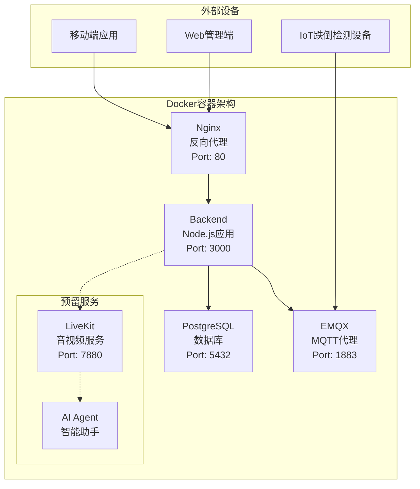
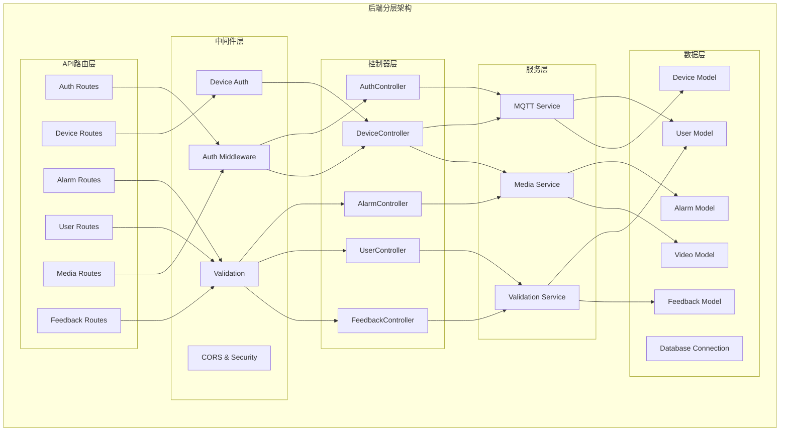
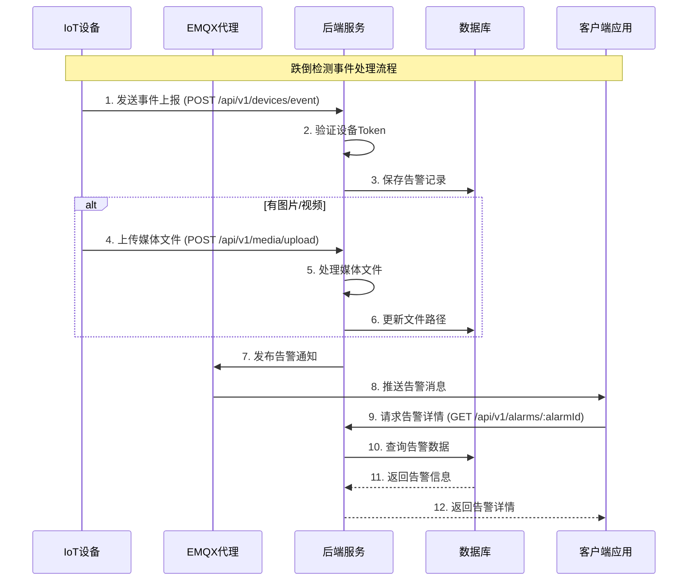

# 跌倒检测系统后端架构文档

## 项目概述

这是一个基于IoT的跌倒检测系统后端，用于接收设备数据、处理告警事件、管理用户和设备，并提供媒体文件服务。系统采用容器化部署，支持实时消息通信和媒体文件处理。

## 整体架构

### 1. Docker容器服务架构



**核心服务组件：**
- **Nginx**: 反向代理、负载均衡、静态文件服务
- **Backend**: Node.js应用服务器，处理API请求和业务逻辑
- **PostgreSQL**: 主数据库，存储用户、设备、告警等数据
- **EMQX**: MQTT消息代理，处理设备和服务器间的实时通信

**预留服务（已配置但暂时注释）：**
- **LiveKit**: 实时音视频通信服务
- **AI Agent**: AI语音助手代理

### 2. 后端应用分层架构



## 数据模型设计

### 数据库ER图

```mermaid
erDiagram
    USER {
        int user_id PK
        string username UK
        string password_hash
        string reset_token
        timestamp created_at
        timestamp updated_at
    }
    
    DEVICE {
        string device_id PK
        int user_id FK UK
        string install_location
        string device_secret
        string status
        timestamp last_active
        json config_json
        timestamp created_at
        timestamp updated_at
    }
    
    ALARM_RECORD {
        bigint alarm_id PK
        string device_id FK
        int user_id FK
        string event_type
        timestamp event_time
        string image_path
        string video_path
        float confidence
        boolean handled
        text alarm_message
        timestamp created_at
        timestamp updated_at
    }
    
    VIDEO {
        bigint video_id PK
        bigint alarm_id FK
        string device_id FK
        timestamp start_time
        int duration
        string video_path
        int file_size
        string format
        timestamp created_at
        timestamp updated_at
    }
    
    FEEDBACK {
        int feedback_id PK
        int user_id FK
        int rating
        text content
        timestamp created_at
        timestamp updated_at
    }
    
    USER ||--|| DEVICE : "一对一绑定"
    DEVICE ||--o{ ALARM_RECORD : "产生"
    USER ||--o{ ALARM_RECORD : "关联"
    ALARM_RECORD ||--|| VIDEO : "包含"
    USER ||--o{ FEEDBACK : "提交"
```

### 主要数据表说明

- **users**: 用户信息、认证数据、密码重置令牌
- **devices**: 设备信息、状态、配置、安装位置（与用户一对一关系）
- **alarm_records**: 告警事件、处理状态、媒体路径、置信度
- **videos**: 视频文件信息、元数据、时长、格式
- **feedbacks**: 用户反馈、评分、内容

## 业务流程设计

### 跌倒检测事件处理流程



## 核心功能模块

### 1. 用户认证模块 (Auth)
- **功能**: 用户注册、登录、密码重置、令牌管理
- **技术**: JWT Token认证、密码哈希
- **文件**: 
  - `src/controllers/authController.js`
  - `src/routes/v1/auth.js`
  - `src/middleware/auth.js`
  - `src/validation/authSchemas.js`

### 2. 设备管理模块 (Device)
- **功能**: 设备注册、状态监控、配置管理、位置信息
- **特性**: 设备认证、状态更新、配置JSON存储
- **文件**:
  - `src/controllers/deviceController.js`
  - `src/routes/v1/devices.js`
  - `src/models/Device.js`
  - `src/middleware/deviceAuth.js`

### 3. 告警处理模块 (Alarm)
- **功能**: 跌倒事件检测、告警记录、处理状态管理
- **特性**: 实时告警、置信度评估、处理追踪、媒体关联
- **文件**:
  - `src/controllers/alarmController.js`
  - `src/routes/v1/alarms.js`
  - `src/models/AlarmRecord.js`

### 4. 媒体管理模块 (Media)
- **功能**: 图片/视频上传、存储、下载、URL生成
- **特性**: 文件分类存储、访问控制、格式验证
- **文件**:
  - `src/routes/v1/media.js`
  - `src/models/Video.js`

### 5. MQTT通信模块
- **功能**: 设备消息订阅、告警推送、实时通信
- **特性**: 自动重连、消息持久化、QoS保证、主题管理
- **文件**:
  - `src/services/mqttService.js`

### 6. 用户管理模块 (User)
- **功能**: 用户信息管理、权限控制
- **文件**:
  - `src/controllers/userController.js`
  - `src/routes/v1/users.js`
  - `src/models/User.js`

### 7. 反馈管理模块 (Feedback)
- **功能**: 用户反馈收集、评分管理
- **特性**: 评分验证、内容存储、用户关联
- **文件**:
  - `src/controllers/feedbackController.js`
  - `src/routes/v1/feedback.js`
  - `src/models/Feedback.js`
  - `src/validation/feedbackSchemas.js`

## 技术栈

### 后端技术
- **运行时**: Node.js (>=18.0.0)
- **框架**: Express.js
- **数据库**: PostgreSQL
- **ORM**: Sequelize
- **认证**: JWT (jsonwebtoken)
- **密码加密**: bcrypt
- **文件上传**: multer
- **数据验证**: Joi
- **日志**: morgan
- **安全**: helmet, cors
- **工具库**: moment, uuid, validator

### 消息通信
- **MQTT代理**: EMQX v5
- **客户端**: mqtt.js

### 容器化与部署
- **容器**: Docker
- **编排**: Docker Compose
- **反向代理**: Nginx
- **数据持久化**: Docker Volumes

### 开发工具
- **测试**: Jest (单元测试、集成测试、API测试)
- **代码热重载**: nodemon
- **代码质量**: ESLint, Prettier
- **API文档**: 手动维护
- **API测试**: 自动化测试脚本

## 文件存储架构

### 目录结构
```
/uploads/              # 设备上传目录
  ├── temp/            # 临时文件目录
  ├── images/          # 告警图片
  │   └── {device_id}/ # 按设备分组
  └── videos/          # 告警视频
      └── {device_id}/ # 按设备分组

/public/               # 公开访问目录
  └── static/          # 静态文件服务
```

### 文件命名规则
- **图片**: `{timestamp}.jpg`
- **视频**: `{timestamp}.mp4`

### 访问URL格式
- **上传**: `POST /api/v1/media/upload`
- **下载**: `GET /api/v1/media/{type}/{deviceId}/{filename}`
- **示例**: `/api/v1/media/images/DEVICE_001/1234567890.jpg`

## API设计

### 路由结构
```
/api/v1/
├── auth/           # 认证相关
│   ├── POST /register
│   ├── POST /login
│   ├── POST /refresh
│   ├── POST /reset-password
│   └── POST /reset-password/:token
├── users/          # 用户管理
│   ├── GET /me
│   ├── PUT /me/username
│   ├── PUT /me/password
│   └── DELETE /me
├── devices/        # 设备管理
│   ├── GET /
│   ├── GET /info
│   ├── POST /register
│   ├── POST /refresh-token
│   ├── POST /heartbeat
│   ├── POST /event
│   ├── POST /unbind
│   ├── PUT /status
│   └── DELETE /
├── alarms/         # 告警管理
│   ├── GET /
│   ├── GET /:alarmId
│   └── POST /:alarmId/ack
├── feedback/       # 反馈管理
│   ├── GET /
│   └── POST /
└── media/          # 媒体文件
    ├── POST /upload
    └── GET /:type/:deviceId/:filename
```

## 消息通信协议

### MQTT主题设计
- **设备状态**: `device/status`
- **跌倒告警**: `fall/detection/alert`
- **系统通知**: `system/notification`

### 消息格式
```json
{
  "device_id": "DEVICE_001",
  "event_type": "fall",
  "event_time": "2024-03-20T10:00:00Z",
  "confidence": 0.95,
  "image_path": "/images/DEVICE_001/1234567890.jpg",
  "video_path": "/videos/DEVICE_001/1234567890.mp4",
  "alarm_message": "检测到跌倒"
}
```

## 安全机制

### 认证与授权
- **用户认证**: Bearer Token（15分钟有效期）
- **用户刷新**: Refresh Token（7天有效期）
- **设备认证**: Device Token（90天有效期）
- **密码重置**: Reset Token（1小时有效期）
- **CORS配置**: 跨域请求控制

### 数据安全
- **密码哈希**: bcrypt加密存储（10轮盐值）
- **SQL注入防护**: Sequelize ORM参数化查询
- **文件上传限制**: 类型和大小验证（最大50MB）
- **输入验证**: Joi数据验证中间件
- **安全头**: Helmet安全防护

## 监控与运维

### 健康检查
- **端点**: `GET /health`
- **响应**: `{"status": "OK"}`

### 日志管理
- **访问日志**: Morgan中间件
- **错误日志**: 统一异常处理
- **MQTT日志**: 连接状态监控
- **调试日志**: 请求路径记录
- **业务日志**: 关键操作记录

### 错误处理
- **全局异常捕获**: Express error middleware
- **数据库连接监控**: 自动重连机制
- **MQTT连接监控**: 自动重连策略
- **文件上传错误**: 临时文件清理
- **验证错误**: 统一错误响应格式

## 扩展能力

### 已预留功能
1. **LiveKit集成**: 实时音视频通信
   - WebRTC媒体传输
   - 信令服务器
   - 会话管理
   - 已配置但暂时注释

2. **AI Agent**: 智能语音助手
   - OpenAI API集成
   - 语音识别(STT)
   - 语音合成(TTS)
   - 已配置但暂时注释

3. **实时推送**: WebSocket/SSE支持预留

4. **MQTT服务**: 已实现但可扩展
   - 设备状态监控
   - 告警消息推送
   - 实时通信

### 性能优化方向
- **数据库索引**: 优化查询性能
- **缓存层**: Redis集成
- **CDN**: 媒体文件分发
- **负载均衡**: 多实例部署
- **连接池**: 数据库连接池优化
- **文件压缩**: 媒体文件压缩

### 微服务化改造
- **服务拆分**: 按业务域分离（认证、设备、告警、媒体、反馈）
- **API网关**: 统一入口管理
- **服务发现**: 自动服务注册
- **配置中心**: 统一配置管理
- **消息队列**: 异步处理解耦
- **分布式存储**: 媒体文件分布式存储

## 部署说明

### 环境要求
- Docker 20.0+
- Docker Compose 2.0+
- Node.js >=18.0.0
- PostgreSQL 12+
- 至少2GB内存
- 至少10GB存储空间

### 启动命令
```bash
# 生产环境部署
docker-compose up -d

# 开发环境部署
docker-compose up

# 本地开发
npm install
npm run dev

# 测试
npm test
```

### 环境变量配置
```env
# 数据库配置
DB_HOST=db
DB_PORT=5432
DB_USER=postgres
DB_PASSWORD=postgres
DB_NAME=fall_detection
DB_SSL=false

# JWT配置
JWT_SECRET=your_jwt_secret_key_here

# MQTT配置
MQTT_BROKER=mqtt://localhost:1883

# 服务器配置
PORT=3000
NODE_ENV=production

# 文件上传配置
UPLOAD_DIR=uploads
```

## 总结

这个跌倒检测系统后端采用了现代化的容器化架构设计，具有以下特点：

1. **高可用性**: 容器化部署，支持自动重启和健康检查
2. **实时性**: MQTT消息通信，支持设备实时数据传输
3. **可扩展性**: 分层架构设计，易于功能扩展和服务拆分
4. **安全性**: 多层认证机制，数据加密存储
5. **维护性**: 统一的错误处理和日志管理
6. **用户友好**: 完整的用户反馈系统，支持评分和内容反馈
7. **设备管理**: 一对一用户设备绑定，简化设备管理
8. **媒体处理**: 完整的文件上传、存储和访问服务
9. **前瞻性**: 预留AI和实时通信能力

系统能够满足IoT跌倒检测的核心需求，同时为未来的功能扩展提供了良好的基础架构。 