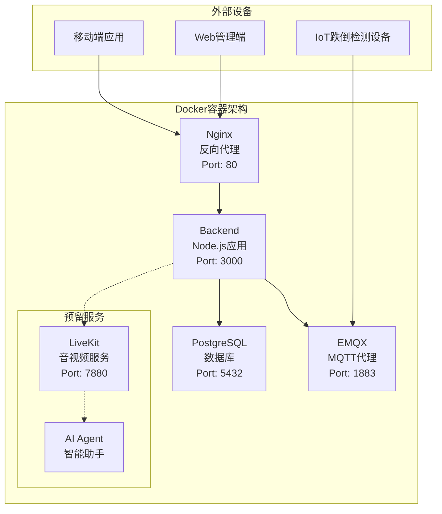
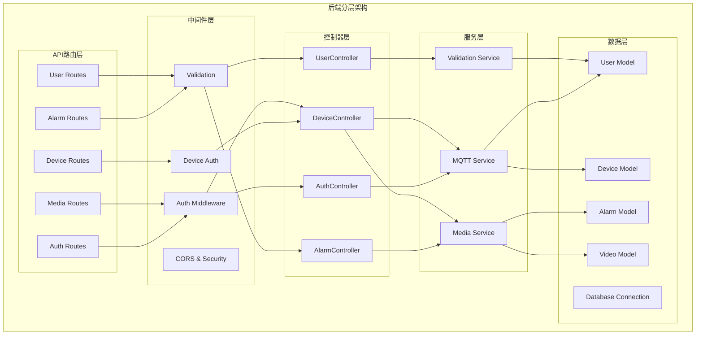
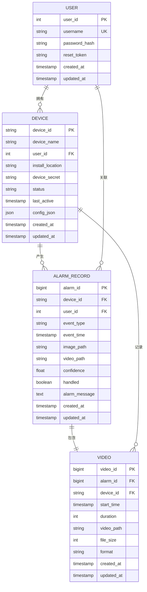
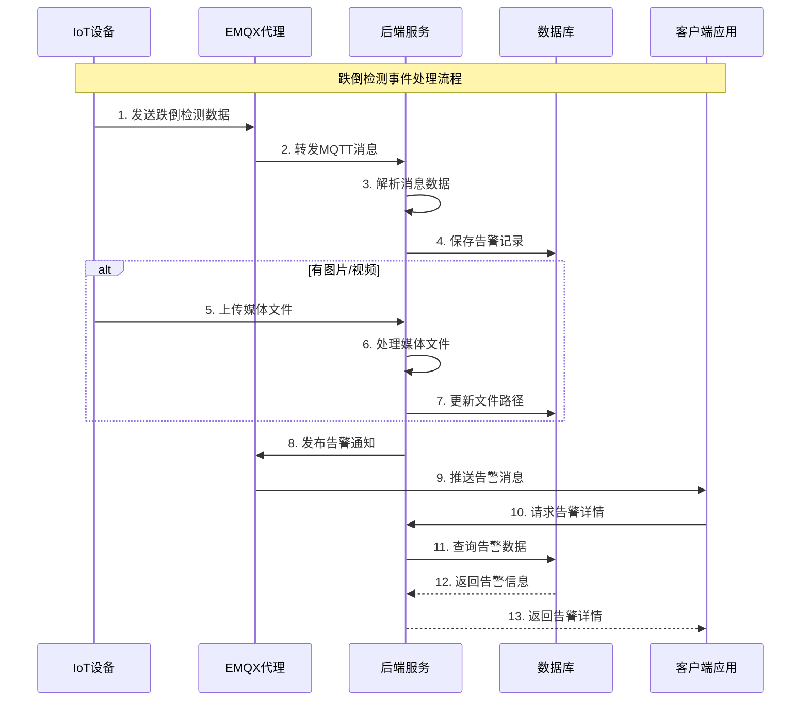

# 跌倒检测系统后端架构文档

## 项目概述

这是一个基于IoT的跌倒检测系统后端，用于接收设备数据、处理告警事件、管理用户和设备，并提供媒体文件服务。系统采用容器化部署，支持实时消息通信和媒体文件处理。

## 整体架构

### 1. Docker容器服务架构



**核心服务组件：**
- **Nginx**: 反向代理、负载均衡、静态文件服务
- **Backend**: Node.js应用服务器，处理API请求和业务逻辑
- **PostgreSQL**: 主数据库，存储用户、设备、告警等数据
- **EMQX**: MQTT消息代理，处理设备和服务器间的实时通信

**预留服务（已配置但暂时注释）：**
- **LiveKit**: 实时音视频通信服务
- **AI Agent**: AI语音助手代理

### 2. 后端应用分层架构



## 数据模型设计

### 数据库ER图



### 主要数据表说明

- **users**: 用户信息、认证数据、密码重置令牌
- **devices**: 设备信息、状态、配置、安装位置
- **alarm_records**: 告警事件、处理状态、媒体路径、置信度
- **videos**: 视频文件信息、元数据、时长、格式

## 业务流程设计

### 跌倒检测事件处理流程



## 核心功能模块

### 1. 用户认证模块 (Auth)
- **功能**: 用户注册、登录、密码重置、令牌管理
- **技术**: JWT Token认证、密码哈希
- **文件**: 
  - `src/controllers/authController.js`
  - `src/routes/v1/auth.js`
  - `src/middleware/auth.js`
  - `src/validation/authSchemas.js`

### 2. 设备管理模块 (Device)
- **功能**: 设备注册、状态监控、配置管理、位置信息
- **特性**: 设备认证、状态更新、配置JSON存储
- **文件**:
  - `src/controllers/deviceController.js`
  - `src/routes/v1/devices.js`
  - `src/models/Device.js`
  - `src/middleware/deviceAuth.js`

### 3. 告警处理模块 (Alarm)
- **功能**: 跌倒事件检测、告警记录、处理状态管理
- **特性**: 实时告警、置信度评估、处理追踪、媒体关联
- **文件**:
  - `src/controllers/alarmController.js`
  - `src/routes/v1/alarms.js`
  - `src/models/AlarmRecord.js`

### 4. 媒体管理模块 (Media)
- **功能**: 图片/视频上传、存储、下载、URL生成
- **特性**: 文件分类存储、访问控制、格式验证
- **文件**:
  - `src/routes/v1/media.js`
  - `src/models/Video.js`

### 5. MQTT通信模块
- **功能**: 设备消息订阅、告警推送、实时通信
- **特性**: 自动重连、消息持久化、QoS保证、主题管理
- **文件**:
  - `src/services/mqttService.js`

### 6. 用户管理模块 (User)
- **功能**: 用户信息管理、权限控制
- **文件**:
  - `src/controllers/userController.js`
  - `src/routes/v1/users.js`
  - `src/models/User.js`

## 技术栈

### 后端技术
- **运行时**: Node.js 
- **框架**: Express.js
- **数据库**: PostgreSQL
- **ORM**: Sequelize
- **认证**: JWT (jsonwebtoken)
- **密码加密**: bcrypt
- **文件上传**: multer
- **日志**: morgan
- **安全**: helmet, cors

### 消息通信
- **MQTT代理**: EMQX v5
- **客户端**: mqtt.js

### 容器化与部署
- **容器**: Docker
- **编排**: Docker Compose
- **反向代理**: Nginx
- **数据持久化**: Docker Volumes

### 开发工具
- **测试**: Jest
- **代码热重载**: nodemon
- **API文档**: 手动维护

## 文件存储架构

### 目录结构
```
/uploads/              # 设备上传目录
  ├── images/          # 告警图片
  │   └── {device_id}/ # 按设备分组
  └── videos/          # 告警视频
      └── {device_id}/ # 按设备分组

/public/               # 公开访问目录
  ├── images/          # 处理后图片
  └── videos/          # 处理后视频
```

### 文件命名规则
- **图片**: `{device_id}_{timestamp}.jpg`
- **视频**: `{device_id}_{timestamp}.mp4`

### 访问URL格式
- **内部路径**: `/uploads/images/{device_id}/{timestamp}.jpg`
- **外部访问**: `/api/v1/media/images/{device_id}/{timestamp}.jpg`

## API设计

### 路由结构
```
/api/v1/
├── auth/           # 认证相关
│   ├── POST /register
│   ├── POST /login
│   └── POST /reset-password
├── users/          # 用户管理
├── devices/        # 设备管理
│   ├── GET /
│   ├── POST /register
│   ├── PUT /:deviceId
│   └── DELETE /:deviceId
├── alarms/         # 告警管理
│   ├── GET /
│   ├── POST /
│   └── PUT /:alarmId/handle
└── media/          # 媒体文件
    ├── GET /images/:deviceId/:filename
    └── GET /videos/:deviceId/:filename
```

## 消息通信协议

### MQTT主题设计
- **设备状态**: `device/status/{device_id}`
- **跌倒告警**: `alert/fall/{device_id}`
- **系统通知**: `system/notification`

### 消息格式
```json
{
  "device_id": "string",
  "event_type": "fall_detected",
  "timestamp": "2024-01-01T12:00:00Z",
  "confidence": 0.95,
  "location": "客厅",
  "has_media": true
}
```

## 安全机制

### 认证与授权
- **JWT Token**: 用户会话管理
- **设备密钥**: 设备身份验证
- **CORS配置**: 跨域请求控制

### 数据安全
- **密码哈希**: bcrypt加密存储
- **SQL注入防护**: Sequelize ORM参数化查询
- **文件上传限制**: 类型和大小验证

## 监控与运维

### 健康检查
- **端点**: `GET /health`
- **响应**: `{"status": "OK"}`

### 日志管理
- **访问日志**: Morgan中间件
- **错误日志**: 统一异常处理
- **MQTT日志**: 连接状态监控

### 错误处理
- **全局异常捕获**: Express error middleware
- **数据库连接监控**: 自动重连机制
- **MQTT连接监控**: 自动重连策略

## 扩展能力

### 已预留功能
1. **LiveKit集成**: 实时音视频通信
   - WebRTC媒体传输
   - 信令服务器
   - 会话管理

2. **AI Agent**: 智能语音助手
   - OpenAI API集成
   - 语音识别(STT)
   - 语音合成(TTS)

3. **实时推送**: WebSocket/SSE支持预留

### 性能优化方向
- **数据库索引**: 优化查询性能
- **缓存层**: Redis集成
- **CDN**: 媒体文件分发
- **负载均衡**: 多实例部署

### 微服务化改造
- **服务拆分**: 按业务域分离
- **API网关**: 统一入口管理
- **服务发现**: 自动服务注册
- **配置中心**: 统一配置管理

## 部署说明

### 环境要求
- Docker 20.0+
- Docker Compose 2.0+
- 至少2GB内存
- 至少10GB存储空间

### 启动命令
```bash
# 生产环境部署
docker-compose up -d

# 开发环境部署
docker-compose up
```

### 环境变量配置
```env
# 数据库配置
DB_HOST=db
DB_PORT=5432
DB_USER=postgres
DB_PASSWORD=postgres
DB_NAME=fall_detection

# JWT密钥
JWT_SECRET=your_secure_jwt_secret_key_here
JWT_REFRESH_SECRET=your_secure_refresh_secret_key_here

# MQTT配置
MQTT_BROKER=mqtt://emqx:1883

# 其他配置
NODE_ENV=production
CORS_ORIGIN=*
```

## 总结

这个跌倒检测系统后端采用了现代化的容器化架构设计，具有以下特点：

1. **高可用性**: 容器化部署，支持自动重启和健康检查
2. **实时性**: MQTT消息通信，支持设备实时数据传输
3. **可扩展性**: 分层架构设计，易于功能扩展和服务拆分
4. **安全性**: 多层认证机制，数据加密存储
5. **维护性**: 统一的错误处理和日志管理
6. **前瞻性**: 预留AI和实时通信能力

系统能够满足IoT跌倒检测的核心需求，同时为未来的功能扩展提供了良好的基础架构。 