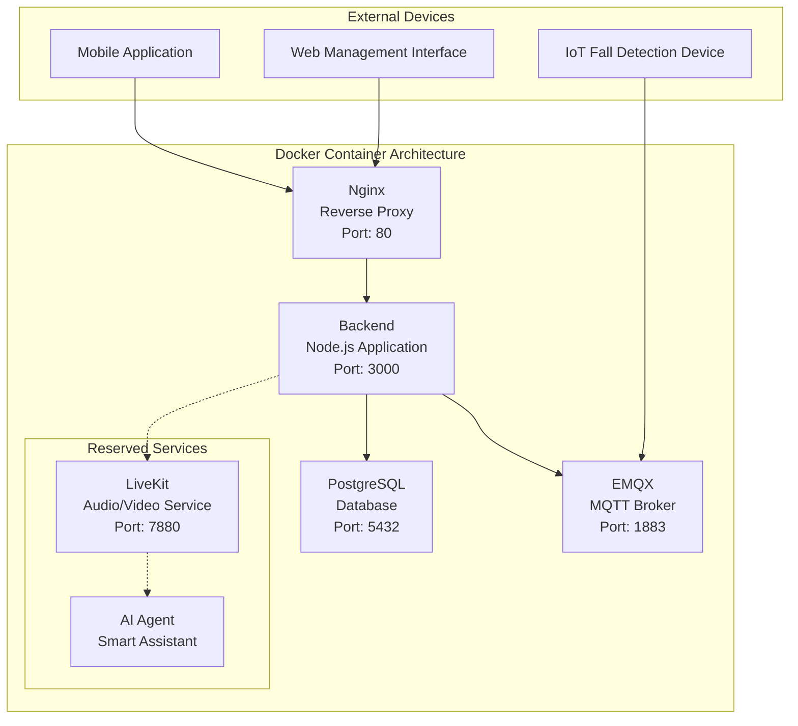
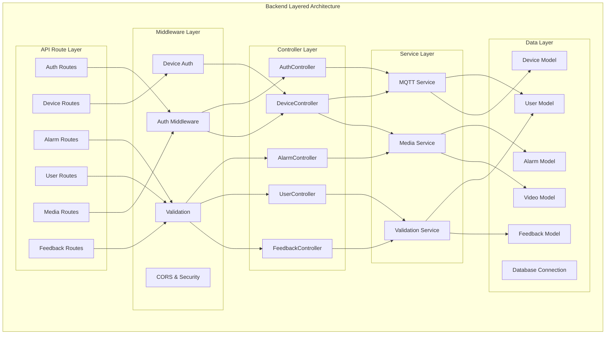
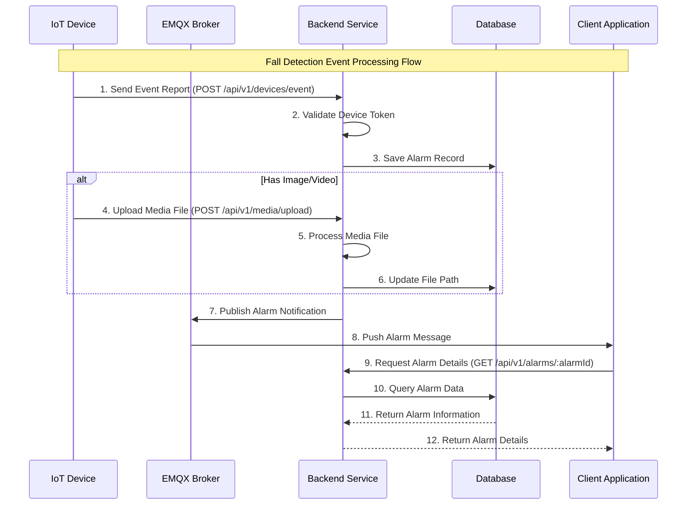

# Fall Detection System Backend Architecture Documentation

## Project Overview

This is an IoT-based fall detection system backend designed to receive device data, process alarm events, manage users and devices, and provide media file services. The system adopts containerized deployment and supports real-time message communication and media file processing.

## Overall Architecture

### 1. Docker Container Service Architecture



**Core Service Components:**
- **Nginx**: Reverse proxy, load balancing, static file service
- **Backend**: Node.js application server, handling API requests and business logic
- **PostgreSQL**: Main database, storing user, device, alarm, and other data
- **EMQX**: MQTT message broker, handling real-time communication between devices and server

**Reserved Services (configured but temporarily commented):**
- **LiveKit**: Real-time audio/video communication service
- **AI Agent**: AI voice assistant agent

### 2. Backend Application Layered Architecture



## Data Model Design

### Database ER Diagram

```mermaid
erDiagram
    USER {
        int user_id PK
        string username UK
        string password_hash
        string reset_token
        timestamp created_at
        timestamp updated_at
    }
    
    DEVICE {
        string device_id PK
        int user_id FK UK
        string install_location
        string device_secret
        string status
        timestamp last_active
        json config_json
        timestamp created_at
        timestamp updated_at
    }
    
    ALARM_RECORD {
        bigint alarm_id PK
        string device_id FK
        int user_id FK
        string event_type
        timestamp event_time
        string image_path
        string video_path
        float confidence
        boolean handled
        text alarm_message
        timestamp created_at
        timestamp updated_at
    }
    
    VIDEO {
        bigint video_id PK
        bigint alarm_id FK
        string device_id FK
        timestamp start_time
        int duration
        string video_path
        int file_size
        string format
        timestamp created_at
        timestamp updated_at
    }
    
    FEEDBACK {
        int feedback_id PK
        int user_id FK
        int rating
        text content
        timestamp created_at
        timestamp updated_at
    }
    
    USER ||--|| DEVICE : "One-to-One Binding"
    DEVICE ||--o{ ALARM_RECORD : "Generates"
    USER ||--o{ ALARM_RECORD : "Associated"
    ALARM_RECORD ||--|| VIDEO : "Contains"
    USER ||--o{ FEEDBACK : "Submits"
```

### Main Data Table Descriptions

- **users**: User information, authentication data, password reset tokens
- **devices**: Device information, status, configuration, installation location (one-to-one relationship with users)
- **alarm_records**: Alarm events, processing status, media paths, confidence levels
- **videos**: Video file information, metadata, duration, format
- **feedbacks**: User feedback, ratings, content

## Business Process Design

### Fall Detection Event Processing Flow



## Core Functional Modules

### 1. User Authentication Module (Auth)
- **Function**: User registration, login, password reset, token management
- **Technology**: JWT Token authentication, password hashing
- **Files**: 
  - `src/controllers/authController.js`
  - `src/routes/v1/auth.js`
  - `src/middleware/auth.js`
  - `src/validation/authSchemas.js`

### 2. Device Management Module (Device)
- **Function**: Device registration, status monitoring, configuration management, location information
- **Features**: Device authentication, status updates, configuration JSON storage
- **Files**:
  - `src/controllers/deviceController.js`
  - `src/routes/v1/devices.js`
  - `src/models/Device.js`
  - `src/middleware/deviceAuth.js`

### 3. Alarm Processing Module (Alarm)
- **Function**: Fall event detection, alarm recording, processing status management
- **Features**: Real-time alarms, confidence assessment, processing tracking, media association
- **Files**:
  - `src/controllers/alarmController.js`
  - `src/routes/v1/alarms.js`
  - `src/models/AlarmRecord.js`

### 4. Media Management Module (Media)
- **Function**: Image/video upload, storage, download, URL generation
- **Features**: File classification storage, access control, format validation
- **Files**:
  - `src/routes/v1/media.js`
  - `src/models/Video.js`

### 5. MQTT Communication Module
- **Function**: Device message subscription, alarm push, real-time communication
- **Features**: Auto-reconnection, message persistence, QoS guarantee, topic management
- **Files**:
  - `src/services/mqttService.js`

### 6. User Management Module (User)
- **Function**: User information management, permission control
- **Files**:
  - `src/controllers/userController.js`
  - `src/routes/v1/users.js`
  - `src/models/User.js`

### 7. Feedback Management Module (Feedback)
- **Function**: User feedback collection, rating management
- **Features**: Rating validation, content storage, user association
- **Files**:
  - `src/controllers/feedbackController.js`
  - `src/routes/v1/feedback.js`
  - `src/models/Feedback.js`
  - `src/validation/feedbackSchemas.js`

## Technology Stack

### Backend Technology
- **Runtime**: Node.js (>=18.0.0)
- **Framework**: Express.js
- **Database**: PostgreSQL
- **ORM**: Sequelize
- **Authentication**: JWT (jsonwebtoken)
- **Password Encryption**: bcrypt
- **File Upload**: multer
- **Data Validation**: Joi
- **Logging**: morgan
- **Security**: helmet, cors
- **Utility Libraries**: moment, uuid, validator

### Message Communication
- **MQTT Broker**: EMQX v5
- **Client**: mqtt.js

### Containerization and Deployment
- **Container**: Docker
- **Orchestration**: Docker Compose
- **Reverse Proxy**: Nginx
- **Data Persistence**: Docker Volumes

### Development Tools
- **Testing**: Jest (unit testing, integration testing, API testing)
- **Code Hot Reload**: nodemon
- **Code Quality**: ESLint, Prettier
- **API Documentation**: Manually maintained
- **API Testing**: Automated test scripts

## File Storage Architecture

### Directory Structure
```
/uploads/              # Device upload directory
  ├── temp/            # Temporary file directory
  ├── images/          # Alarm images
  │   └── {device_id}/ # Grouped by device
  └── videos/          # Alarm videos
      └── {device_id}/ # Grouped by device

/public/               # Public access directory
  └── static/          # Static file service
```

### File Naming Rules
- **Images**: `{timestamp}.jpg`
- **Videos**: `{timestamp}.mp4`

### Access URL Format
- **Upload**: `POST /api/v1/media/upload`
- **Download**: `GET /api/v1/media/{type}/{deviceId}/{filename}`
- **Example**: `/api/v1/media/images/DEVICE_001/1234567890.jpg`

## API Design

### Route Structure
```
/api/v1/
├── auth/           # Authentication related
│   ├── POST /register
│   ├── POST /login
│   ├── POST /refresh
│   ├── POST /reset-password
│   └── POST /reset-password/:token
├── users/          # User management
│   ├── GET /me
│   ├── PUT /me/username
│   ├── PUT /me/password
│   └── DELETE /me
├── devices/        # Device management
│   ├── GET /
│   ├── GET /info
│   ├── POST /register
│   ├── POST /refresh-token
│   ├── POST /heartbeat
│   ├── POST /event
│   ├── POST /unbind
│   ├── PUT /status
│   └── DELETE /
├── alarms/         # Alarm management
│   ├── GET /
│   ├── GET /:alarmId
│   └── POST /:alarmId/ack
├── feedback/       # Feedback management
│   ├── GET /
│   └── POST /
└── media/          # Media files
    ├── POST /upload
    └── GET /:type/:deviceId/:filename
```

## Message Communication Protocol

### MQTT Topic Design
- **Device Status**: `device/status`
- **Fall Alarm**: `fall/detection/alert`
- **System Notification**: `system/notification`

### Message Format
```json
{
  "device_id": "DEVICE_001",
  "event_type": "fall",
  "event_time": "2024-03-20T10:00:00Z",
  "confidence": 0.95,
  "image_path": "/images/DEVICE_001/1234567890.jpg",
  "video_path": "/videos/DEVICE_001/1234567890.mp4",
  "alarm_message": "Fall detected"
}
```

## Security Mechanisms

### Authentication and Authorization
- **User Authentication**: Bearer Token (15-minute validity)
- **User Refresh**: Refresh Token (7-day validity)
- **Device Authentication**: Device Token (90-day validity)
- **Password Reset**: Reset Token (1-hour validity)
- **CORS Configuration**: Cross-origin request control

### Data Security
- **Password Hashing**: bcrypt encrypted storage (10 rounds of salt)
- **SQL Injection Protection**: Sequelize ORM parameterized queries
- **File Upload Restrictions**: Type and size validation (max 50MB)
- **Input Validation**: Joi data validation middleware
- **Security Headers**: Helmet security protection

## Monitoring and Operations

### Health Check
- **Endpoint**: `GET /health`
- **Response**: `{"status": "OK"}`

### Log Management
- **Access Logs**: Morgan middleware
- **Error Logs**: Unified exception handling
- **MQTT Logs**: Connection status monitoring
- **Debug Logs**: Request path recording
- **Business Logs**: Key operation recording

### Error Handling
- **Global Exception Capture**: Express error middleware
- **Database Connection Monitoring**: Auto-reconnection mechanism
- **MQTT Connection Monitoring**: Auto-reconnection strategy
- **File Upload Errors**: Temporary file cleanup
- **Validation Errors**: Unified error response format

## Extension Capabilities

### Reserved Features
1. **LiveKit Integration**: Real-time audio/video communication
   - WebRTC media transmission
   - Signaling server
   - Session management
   - Configured but temporarily commented

2. **AI Agent**: Smart voice assistant
   - OpenAI API integration
   - Speech recognition (STT)
   - Speech synthesis (TTS)
   - Configured but temporarily commented

3. **Real-time Push**: WebSocket/SSE support reserved

4. **MQTT Service**: Implemented but extensible
   - Device status monitoring
   - Alarm message push
   - Real-time communication

### Performance Optimization Directions
- **Database Indexing**: Query performance optimization
- **Cache Layer**: Redis integration
- **CDN**: Media file distribution
- **Load Balancing**: Multi-instance deployment
- **Connection Pool**: Database connection pool optimization
- **File Compression**: Media file compression

### Microservice Transformation
- **Service Splitting**: Separation by business domain (auth, device, alarm, media, feedback)
- **API Gateway**: Unified entry management
- **Service Discovery**: Automatic service registration
- **Configuration Center**: Unified configuration management
- **Message Queue**: Asynchronous processing decoupling
- **Distributed Storage**: Distributed media file storage

## Deployment Instructions

### Environment Requirements
- Docker 20.0+
- Docker Compose 2.0+
- Node.js >=18.0.0
- PostgreSQL 12+
- At least 2GB memory
- At least 10GB storage space

### Startup Commands
```bash
# Production environment deployment
docker-compose up -d

# Development environment deployment
docker-compose up

# Local development
npm install
npm run dev

# Testing
npm test
```

### Environment Variable Configuration
```env
# Database configuration
DB_HOST=db
DB_PORT=5432
DB_USER=postgres
DB_PASSWORD=postgres
DB_NAME=fall_detection
DB_SSL=false

# JWT configuration
JWT_SECRET=your_jwt_secret_key_here

# MQTT configuration
MQTT_BROKER=mqtt://localhost:1883

# Server configuration
PORT=3000
NODE_ENV=production

# File upload configuration
UPLOAD_DIR=uploads
```

## Summary

This fall detection system backend adopts a modern containerized architecture design with the following characteristics:

1. **High Availability**: Containerized deployment with automatic restart and health checks
2. **Real-time Capability**: MQTT message communication supporting real-time device data transmission
3. **Scalability**: Layered architecture design, easy to extend functionality and split services
4. **Security**: Multi-layer authentication mechanisms, encrypted data storage
5. **Maintainability**: Unified error handling and log management
6. **User-Friendly**: Complete user feedback system supporting ratings and content feedback
7. **Device Management**: One-to-one user-device binding, simplified device management
8. **Media Processing**: Complete file upload, storage, and access services
9. **Forward-Looking**: Reserved AI and real-time communication capabilities

The system can meet the core requirements of IoT fall detection while providing a solid foundation architecture for future functional extensions. 